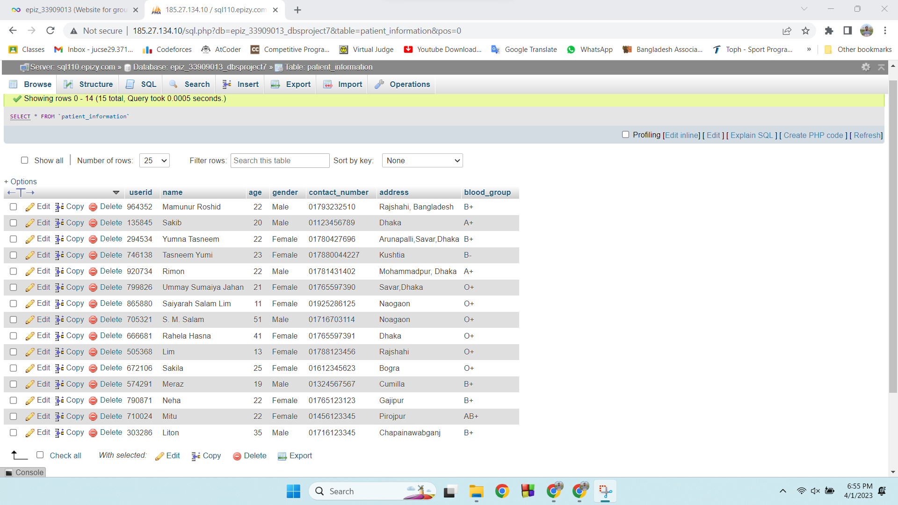

# This is Hospital Management App
## Patient can registration in this system 
## Patient will get a unique registration number
## Patient can book a appointment of his preference doctor and preference department

  <h3>Landing Page</h3>
  

  <h3>Registration Page</h3>
  

  <h3>Appointment Page</h3>
  

  <h3>Database Page 1</h3>
  

  <h3>Database Page 2</h3>
  

  <h3>Database Page 3</h3>
  

